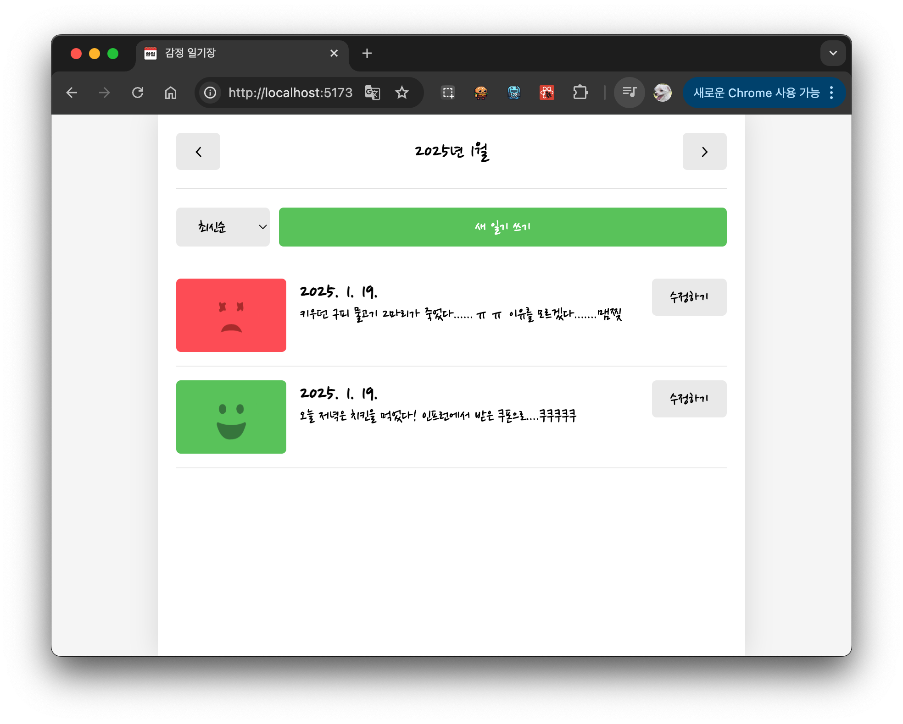
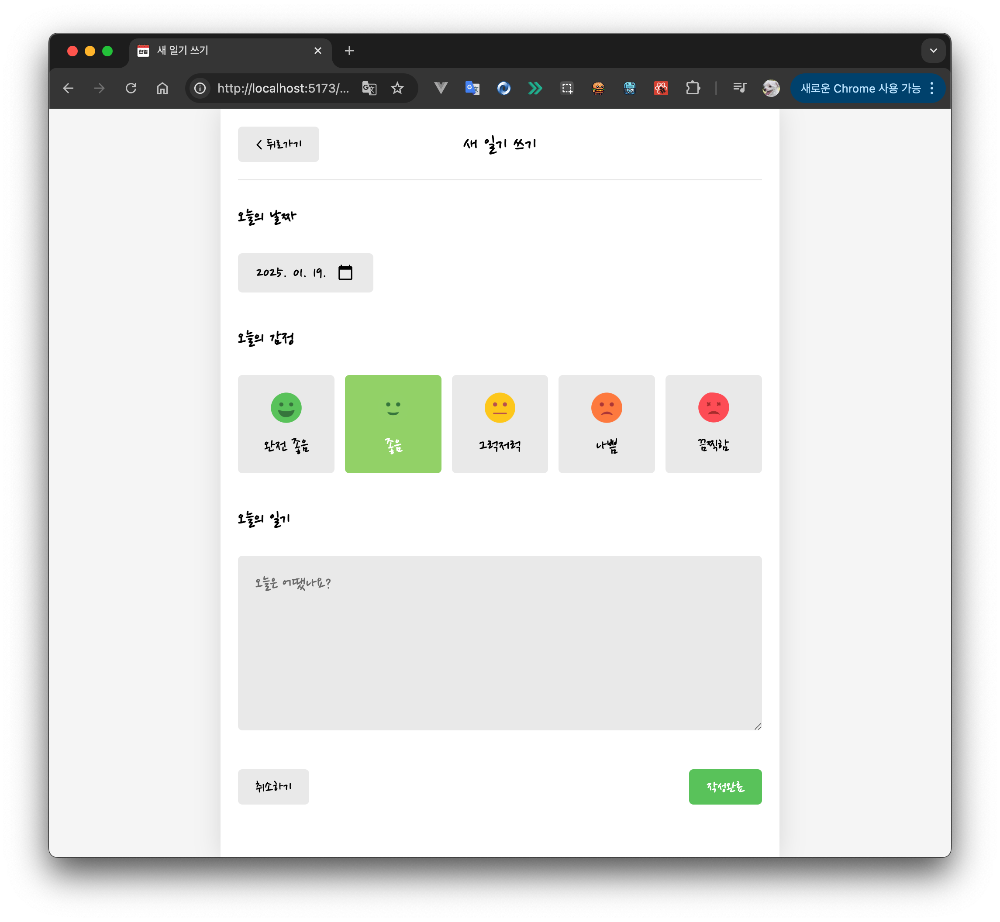
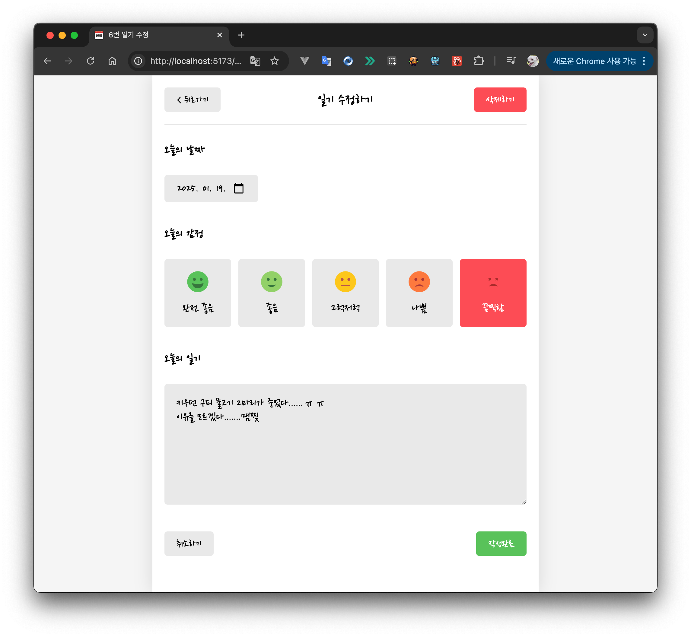

# Main Project: 감정 일기장
 Javascript, React, Vite

<b><i>home</i></b>

<b><i>new</i></b>

<b><i>edit</i></b>

### 적용된 기술들
* useState
* useRef
* useNavigate
* useParams
* useEffect
* useReducer
* createContext
* useContext
* custom hook
---
* share(constant)
* util(function)
---
* css
* favicon
* font
* thumbnail
* assets(emotion images)
---
* vercel